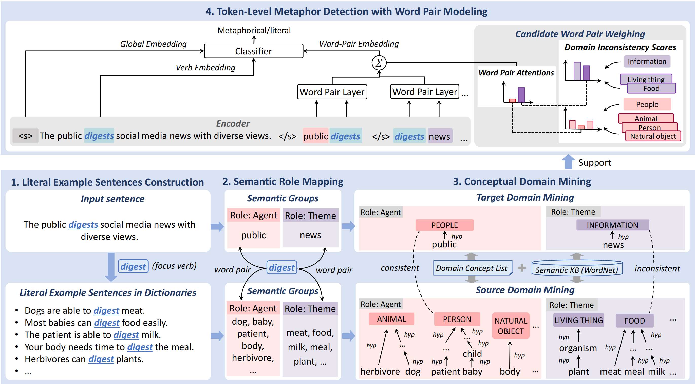

# WPDM
This repository contains (PyTorch) code for Explainable Word-Pair based Domain Mining method (WPDM), described by the paper *Bridging Word-Pair and Token-Level Metaphor Detection with Explainable Domain Mining* accepted by ACL 2024.
## Quick links
- [WPDM](#wpdm)
  - [Quick links](#quick-links)
  - [Overview](#overview)
  - [Setup](#setup)
    - [Install dependencies](#install-dependencies)
    - [Datasets](#datasets)
    - [Pretrained model](#pretrained-model)
  - [Model](#model)
    - [Conceptual domain mining](#conceptual-domain-mining)
    - [Train the model](#train-the-model)
  - [Citation](#citation)
  - [Acknowledgements](#acknowledgements)
  - [References](#references)

## Overview

In this work, we present a novel Explainable Word-Pair based Domain Mining method (WPDM) for token-level verb metaphor detection. 
Please find more details of this work in our paper.
## Setup

### Install dependencies
Please install all the dependency packages using the following command:
```
pip install -r requirements.txt
```

Please install stanfordcorenlp and download stanford-corenlp-full-2018-10-05 from https://stanfordnlp.github.io/CoreNLP/index.html

### Datasets

Our experiments are based on four metaphor detection datasets. MOH-X, TroFi and VUA-Verb are in the folder `datasets/`. LCC-Verb are constructed from LCC dataset (Mohler et al., 2016). The code to construct LCC-Verb is in the folder `datasets/LCC_Verb/`. Please contact the author of the original paper (Mohler et al., 2016) for LCC dataset.


### Pretrained model
Download the pre-trained model roberta-base and corresponding files from 
[roberta-base](https://huggingface.co/roberta-base/). Put these files in `roberta-base/` folder.


## Model

### Conceptual domain mining
The files for conceptual domain mining are in the fold `scripts_WPDM/`.

You can find the dataset after conceptual domain mining from the [datasets_with_WPDom](https://drive.google.com/file/d/1uzCeF0wBjTzKiaJx7ye-Fi9SRq3wck9e/view?usp=drive_link).

### Train the model
The parameter configuration files for training and testing are in the fold `config/`.
You can use `run.py` to train a DynRT model. A command template is as follows:
```bash
CUDA_VISIBLE_DEVICES=0,1 python run.py --conf_file {path of the parameter configuration file} \
```


## Citation

If you find this repo useful for your research, please consider citing our paper.

```
@inproceedings{MPDB2024,
  author    = {Tian, Yuan and
                Zhang, Ruike and 
               Xu, Nan and
               Mao, Wenji},
  title     = {Bridging Word-Pair and Token-Level Metaphor Detection with Explainable Domain Mining},
  booktitle = {Proceedings of the 62th Annual Meeting of the Association for Computational Linguistics},
  publisher = {Association for Computational Linguistics},
  year      = {2024}
}
```
## Acknowledgements

Thanks for the LCC dataset from Mohler et al. (2016).

Thanks for the datasets from https://github.com/SilasTHU/MisNet

The license of MOH-X dataset is available at https://saifmohammad.com/WebPages/SentimentEmotionLabeledData.html

The license of TroFi dataset is available at https://www2.cs.sfu.ca/~anoop/students/jbirke/LICENSE.html

Thanks for the RoBERTa model from https://huggingface.co/roberta-base/

Thanks for the VerbNet Parser from https://github.com/jgung/verbnet-parser

Thanks for the Stanford CoreNLP from https://stanfordnlp.github.io/CoreNLP/

## References

Michael Mohler, Mary Brunson, Bryan Rink, and Marc Tomlinson. 2016. Introducing the LCC metaphor datasets. In Proceedings of the International Conference on Language Resources and Evaluation, pages 4221–4227.